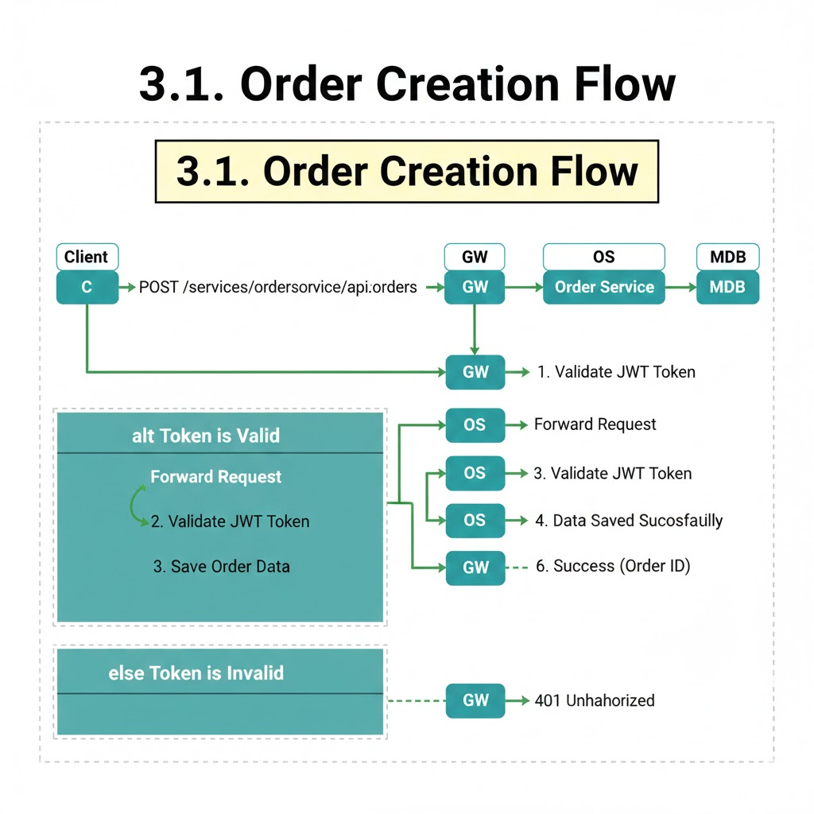

== Order Microservice Architecture

Master Huthiu <cosa199212@gmail.com>
v1.0, 2026 
:toc: left
:toclevels: 3
:icons: font
:source-highlighter: highlightjs
:sectnums:

== 1. Project Overview
The **Order Microservice** is a high-performance component within an e-commerce ecosystem. It is responsible for managing the entire order lifecycle—from initialization and validation to payment status synchronization.

[NOTE]
====
This service is built on the **JHipster 8** framework, optimized for Cloud-Native environments and Kubernetes orchestration.
====

== 2. Technical Stack

[cols="1,3", options="header"]
|===
| Component | Technology
| *Framework* | Spring Boot 3.4.5 (Java 21)
| *Database* | MongoDB (NoSQL)
| *Service Discovery* | HashiCorp Consul
| *Security* | Stateless JWT (Shared Secret)
| *Infrastructure* | Docker, Kubernetes (K8s)
|===

== 3. System Architecture

=== 3.1. Request Flow
The system follows a distributed Microservices pattern:

1. *Client* sends a request via the *API Gateway*.
2. *Gateway* performs Load Balancing and Routing based on registry data from *Consul*.
3. *Order Service* validates the JWT and executes the Business Logic.
4. Order data is persisted asynchronously in *MongoDB*.

=== 3.2. Data Modeling (JDL)

[source,jdl]
----
entity Order {
    orderDate Instant required,
    totalAmount BigDecimal required,
    status OrderStatus required
}

entity OrderItem {
    movieId String required,
    movieTitle String,
    price BigDecimal required,
    quantity Integer required
}

relationship OneToMany {
    Order{items} to OrderItem{order}
}
----

== 4. API Specifications

=== 4.1. Create New Order
`POST /services/orderservice/api/orders`

[source,json]
----
{
  "orderDate": "2026-02-11T10:30:00Z",
  "totalAmount": 1250.75,
  "status": "PAID"
}
----

[CAUTION]
====
All API requests must include the header `Authorization: Bearer <JWT_TOKEN>`.
====

== 5. Infrastructure as Code (K8s)

Deployment is managed via Kubernetes manifests to ensure environment parity:

[source,yaml]
----
apiVersion: apps/v1
kind: Deployment
metadata:
  name: order-service
spec:
  replicas: 1
  template:
    spec:
      containers:
        - name: order-service
          image: masterhuthiu/order-service:latest
          env:
            - name: SPRING_DATA_MONGODB_URI
              value: mongodb://mongodb:27017/orderService
            - name: JHIPSTER_SECURITY_AUTHENTICATION_JWT_BASE64_SECRET
              value: ${SHARED_JWT_SECRET}
----

== 6. Challenges & Solutions

[qanda]
Consul Connection Refused?::
  *Solution:* Configured `SPRING_CLOUD_CONSUL_HOST` to resolve via internal K8s Service Name instead of localhost.
401 Unauthorized between Gateway and Service?::
  *Solution:* Synchronized the `BASE64_SECRET` across deployments to ensure consistent JWT signing and verification.
Database not auto-initializing?::
  *Solution:* Migrated environment variables from JDBC-based `SPRING_DATASOURCE_URL` to NoSQL-specific `SPRING_DATA_MONGODB_URI`.

== 7. Conclusion
The **Order Service** is currently fully operational on the Kubernetes Cluster, featuring High Availability (HA) and seamless horizontal scalability.

[source,bash]
----
# Verification command
kubectl exec -it mongodb-pod -- mongosh orderService --eval "db.order.find().pretty()"
----